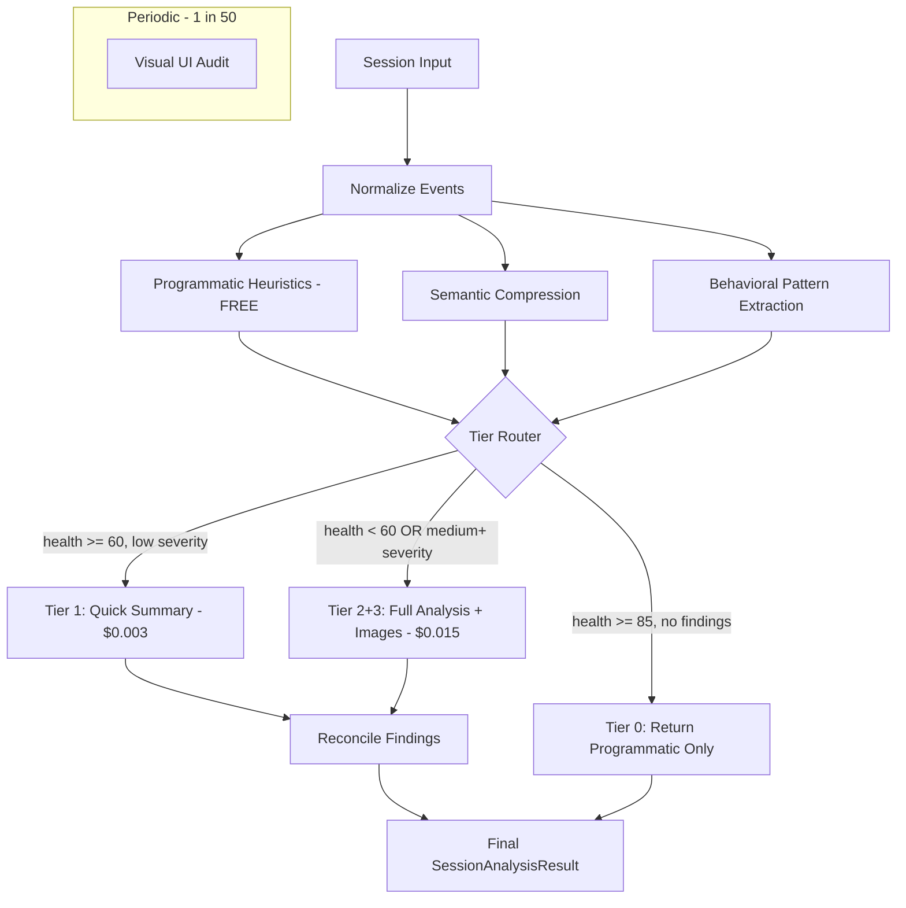

# Optimized Session Analyzer Implementation

## Architecture Overview



## File Structure

All new files go in `scripts/rrweb_analyzer_v2/`:

```
scripts/rrweb_analyzer_v2/
├── __init__.py              # Update exports
├── analysis_schema.py       # Simplify schema
├── analyze.py               # Keep as-is (programmatic)
├── analyze_ai.py            # Keep for reference, may deprecate
├── analyze_with_images_ai.py # Keep for reference, may deprecate
├── normalizer.py            # Keep as-is
├── node_map.py              # Keep as-is
├── keyframes.py             # Update keyframe timing
├── compressor.py            # NEW: Semantic event compression
├── patterns.py              # NEW: Behavioral pattern extraction
├── router.py                # NEW: Tier routing logic
├── analyzer.py              # NEW: Main entry point with tiered analysis
├── prompts.py               # NEW: All prompt templates
└── reconciler.py            # NEW: Finding reconciliation
```

---

## Step 1: Simplify Schema

Update [analysis_schema.py](scripts/rrweb_analyzer_v2/analysis_schema.py):

- Remove `timestamp_descriptions` from `TimestampInterval` (token sink)
- Add `key_events: List[str]` instead (3-5 most significant events)
- Remove redundant `Signal` class (use `Finding` everywhere)
- Add `SessionAnalysisResultLite` for Tier 1 output (summary only)

```python
class TimestampInterval(BaseModel):
    start_time: str
    end_time: str
    short_title: str
    description: str
    findings: List[Finding] = []
    key_events: List[str] = []  # NEW: replaces timestamp_descriptions
```

---

## Step 2: Create Semantic Compressor

Create [compressor.py](scripts/rrweb_analyzer_v2/compressor.py):

Purpose: Convert verbose normalized events into semantic chunks for LLM.

Key functions:

- `compress_events(normalized_events, prog_findings) -> str`: Main compression
- `_is_noise_event(event) -> bool`: Filter mouse moves, focus/blur pairs
- `_group_into_chunks(events) -> List[Chunk]`: Group by action type
- `_summarize_chunk(chunk) -> str`: Convert chunk to one-line summary
- `_insert_finding_markers(chunks, findings)`: Add warning markers

Output format example:

```
[0-3s] User arrived, moved mouse around header
[3s] -> Navigated to #who-its-for
[11s] -> Clicked "Reserve Your Spot" button
[13-18s] Filled form: email -> role="CTO" -> size="1-10" -> selected 2 use cases
[18s] -> Clicked "Join" -> Network POST succeeded (200)
[18-20s] [!] No UI feedback. User scrolled around footer.
[25-28s] [!!] RAGE CLICK: "Reserve Your Spot" 8x in 2.6s
```

---

## Step 3: Create Behavioral Pattern Extractor

Create [patterns.py](scripts/rrweb_analyzer_v2/patterns.py):

Purpose: Extract high-level behavioral signals from events.

Key functions:

- `extract_patterns(normalized_events) -> List[BehavioralPattern]`

Patterns to detect:

- `search_behavior`: scroll up/down repeatedly (direction changes > 5)
- `navigation_confusion`: same URL visited 3+ times
- `hesitation`: 5-30s pause between actions
- `linear_browsing`: smooth scroll through content
- `quick_bounce`: < 15s session on landing page

Output:

```python
@dataclass
class BehavioralPattern:
    type: str  # search_behavior, hesitation, etc.
    description: str
    time_range: Optional[Tuple[float, float]]
    severity: str  # info, warning
```

---

## Step 4: Create Prompt Templates

Create [prompts.py](scripts/rrweb_analyzer_v2/prompts.py):

Three prompt templates:

**TIER1_SUMMARY_PROMPT**: Quick 2-3 sentence summary

- Input: Programmatic findings + behavioral patterns
- Output: Human narrative only
- Target tokens: ~200 output

**TIER2_FULL_PROMPT**: Complete analysis (combines old Tier 2+3)

- Input: Compressed events + behavioral patterns + prog findings + page context
- Output: Narrative + findings with root cause + health score
- Target tokens: ~500-800 output
- Includes instruction to use images if provided

**RECONCILE_PROMPT**: Verify programmatic findings AI missed

- Input: List of discrepant findings
- Output: Classification (real issue / false positive / low severity)
- Target tokens: ~100 output

---

## Step 5: Create Tier Router

Create [router.py](scripts/rrweb_analyzer_v2/router.py):

Purpose: Decide which analysis tier to use.

```python
def route_session(
    prog_result: SessionAnalysisResult,
    behavioral_patterns: List[BehavioralPattern],
    session_meta: dict
) -> Literal["tier0", "tier1", "tier2"]:

    health = prog_result.health_score
    findings = get_all_findings(prog_result)
    max_severity = get_max_severity(findings)

    # Tier 0: No AI needed
    if health >= 85 and not findings:
        return "tier0"

    # Tier 1: Quick summary
    if health >= 60 and max_severity in ("low", None):
        return "tier1"

    # Tier 2: Full analysis (always includes images now)
    return "tier2"

def should_use_images(prog_result, patterns) -> bool:
    """Determine if we should extract keyframes."""
    # Always True for Tier 2 since cost difference is minimal
    return True
```

---

## Step 6: Update Keyframe Extraction

Update [keyframes.py](scripts/rrweb_analyzer_v2/keyframes.py):

Add delayed captures to see results of actions:

```python
# In get_keyframe_timestamps(), after click detection:
if e.startswith("user click on"):
    timestamps.add(round(t, 1))
    timestamps.add(round(t + 1.0, 1))  # Capture AFTER click

if "network:" in e and "POST" in e and "200" in e:
    timestamps.add(round(t + 0.5, 1))  # Capture success state
```

Reduce `DEFAULT_MAX_FRAMES` from 12 to 8 (cost optimization).

---

## Step 7: Create Reconciler

Create [reconciler.py](scripts/rrweb_analyzer_v2/reconciler.py):

Purpose: Merge programmatic and AI findings without bias.

```python
def reconcile_findings(
    prog_findings: List[Finding],
    ai_findings: List[Finding],
    compressed_events: str,
    llm: BaseChatModel
) -> List[Finding]:

    # Find findings only in programmatic
    prog_only = find_unique_findings(prog_findings, ai_findings)

    if not prog_only:
        return ai_findings

    # Ask AI to verify programmatic-only findings
    verified = verify_findings(prog_only, compressed_events, llm)

    # Merge
    final = list(ai_findings)
    for finding, verdict in zip(prog_only, verified):
        if verdict == "real_issue":
            final.append(finding)

    return final
```

---

## Step 8: Create Main Analyzer Entry Point

Create [analyzer.py](scripts/rrweb_analyzer_v2/analyzer.py):

Main entry point that orchestrates everything:

```python
@observe(name="analyze_session_optimized")
def analyze_session(
    raw_session: dict,
    normalized_events: list,
    *,
    force_tier: Optional[str] = None,
    use_gemini: bool = True,
    model: str = "gemini-2.5-flash-preview-09-2025",
) -> Tuple[SessionAnalysisResult, dict]:
    """
    Main entry point for optimized session analysis.

    Returns (result, info) where info contains:
    - tier_used: which tier was selected
    - tokens_in, tokens_out: token usage
    - cost_usd: estimated cost
    - keyframe_count: number of images used
    """

    # Step 1: Always run programmatic (free)
    prog_result = analyze_events(normalized_events)

    # Step 2: Extract behavioral patterns
    patterns = extract_patterns(normalized_events)

    # Step 3: Route to tier
    tier = force_tier or route_session(prog_result, patterns, raw_session)

    # Step 4: Execute tier
    if tier == "tier0":
        return prog_result, {"tier_used": "tier0", "cost_usd": 0}

    # Compress events for AI
    compressed = compress_events(normalized_events, prog_result)

    if tier == "tier1":
        return run_tier1(compressed, patterns, prog_result)

    # Tier 2: Full analysis with images
    return run_tier2(raw_session, compressed, patterns, prog_result)
```

---

## Step 9: Notebook Testing

Update [test_rrweb_2.ipynb](scripts/test_rrweb_2.ipynb):

Create test cells to:

1. **Test compression**: Verify events are compressed properly
2. **Test pattern extraction**: Verify behavioral patterns detected
3. **Test routing**: Verify tier selection logic
4. **Test each tier**: Run Tier 0, 1, 2 separately
5. **Compare costs**: Log token usage and costs for each tier
6. **Compare quality**: Side-by-side output comparison
7. **Test reconciliation**: Verify programmatic + AI findings merge correctly

---

## Step 10: Update Module Exports

Update **[init**.py](scripts/rrweb_analyzer_v2/**init**.py):

Add new exports:

```python
from .analyzer import analyze_session
from .compressor import compress_events
from .patterns import extract_patterns, BehavioralPattern
from .router import route_session
```

---

## Cost Estimation (Revised with Tier 2+3 Combined)

| Tier | When Used                  | Est. % Sessions | Cost/Session | Notes             |
| ---- | -------------------------- | --------------- | ------------ | ----------------- |
| 0    | health >= 85, no findings  | 50%             | $0.000       | Programmatic only |
| 1    | health >= 60, low severity | 30%             | $0.003       | Summary prompt    |
| 2    | health < 60 OR medium+     | 20%             | $0.015       | Full + 8 images   |

**10K sessions**: (5000 × $0) + (3000 × $0.003) + (2000 × $0.015) = **$39**

Leaves headroom for reconciliation calls (~~$5) and periodic visual audits (~~$7).

**Total: ~$51 for 10K sessions = $0.005/session average**

---

## Testing Checklist for Notebook

- Compression reduces events by 60%+
- Behavioral patterns correctly identified
- Tier routing matches expected logic
- Tier 1 output is human-readable, < 200 tokens
- Tier 2 output has findings with root cause
- Images captured AFTER clicks (not just at click time)
- Reconciliation adds valid programmatic findings
- Total cost per session matches estimates
- Output quality is "human-like" and actionable
