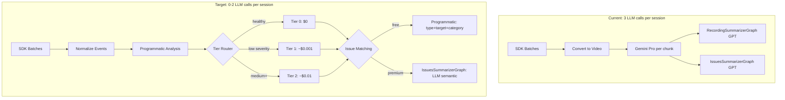

# Session Analyzer Integration Plan (v2)

## Key Decisions

- **Rename recording -> session** throughout codebase (`UserSession` model, `user_session` table)
- **Rename Finding -> Issue** in rrweb schema to align with business language
- **No `findings_json**`column — the`issue`+`issue_session` tables are the source of truth for issues
- **Keep `IssuesSummarizerGraph**`for premium tiers (semantic LLM matching catches cross-type duplicates). **Free tier** uses programmatic matching on`type + target + category` (zero cost)
- **No `RecordingSummarizerGraph**` for rrweb path — analyzer already generates summary/title
- **All tiers treated as premium** for now; free/premium gating is pseudo-code placeholder

## Current vs Target Architecture



---

## Step 1: DB Rename — recording -> session

### 1a. Table and model renames (single Alembic migration)

| Old                  | New Table          | New Model         |
| -------------------- | ------------------ | ----------------- |
| `recording`          | `user_session`     | `UserSession`     |
| `recording_interval` | `session_interval` | `SessionInterval` |
| `issue_recording`    | `issue_session`    | `IssueSession`    |

FK columns: `recording_id` -> `user_session_id` in `session_interval` and `issue_session`.

### 1b. `UserSession` model (was [Recording](models/recording.py))

Keep and rename:

- `file_duration` -> `duration`
- `short_title` -> `title`
- All others stay: `id`, `org_id`, `file_name`, `file_size`, `file_type`, `summary`, `tags`, `session_id`, `client_id`, `client_data`, `meta_data`, `analysis_status`, `analysis_error`, `analysis_progress`, timestamps

Add:

- `health_score: Float, nullable=True`
- `confidence_score: Float, nullable=True`
- `analysis_tier: String(20), nullable=True` — "tier0"/"tier1"/"tier2"/"video"

### 1c. `SessionInterval` model (was [RecordingInterval](models/recording_interval.py))

Keep: `id`, `user_session_id`, `start_time`, `end_time`, `short_title`, `description`, `category`, `issue`, `timestamp_descriptions`, timestamps

Remove `issue` (String column) — part of the API schema (`RecordingIntervalBase.issue`) and may be used by the frontend. Currently written as `""` or `None` but exposed in response/update schema

Add: `severity: String(20), nullable=True`

**No `findings_json`.** Issues live in the `issue` + `issue_session` tables. To get an interval's issues: `SELECT * FROM issue JOIN issue_session ON ... WHERE issue_session.session_interval_id = X`.

### 1d. `Issue` model — add structured fields from analysis

Add to [Issue](models/issue.py):

- `type: String(50), nullable=True` — "rage_click", "dead_click", etc.
- `target: String(500), nullable=True` — element/URL involved
- `confidence: String(20), nullable=True` — "high"/"medium"/"low"

Rename:

- `description` -> `root_cause`
- `recommendation` -> `reproduction_steps`

These renames align the DB model with the analysis output so there is no field mapping confusion.

### 1e. API layer renames

| Old Path                      | New Path                    |
| ----------------------------- | --------------------------- |
| `api/v1/recording/`           | `api/v1/session/`           |
| `api/v1/recording_intervals/` | `api/v1/session_intervals/` |
| `api/v1/issue_recording/`     | `api/v1/issue_session/`     |

Router prefixes: `/api/v1/recordings` -> `/api/v1/sessions`, etc.

All Pydantic schemas: `RecordingCreate` -> `SessionCreate`, `RecordingResponse` -> `SessionResponse`, etc.

All service/repo function names: `get_recording()` -> `get_session()`, etc.

---

## Step 2: Create `rrweb/` Module

Move from `scripts/rrweb_analyzer_v2/` into top-level `rrweb/` package:

```
rrweb/
  __init__.py       # Clean exports
  schema.py         # Issue (was Finding), SessionInterval, SessionAnalysisResult
  normalizer.py     # As-is from scripts/
  node_map.py       # As-is from scripts/
  compressor.py     # As-is from scripts/
  patterns.py       # As-is from scripts/
  keyframes.py      # As-is from scripts/
  heuristics.py     # From analyze.py — rewritten, no Signal
  analyzer.py       # Tiered orchestrator (router folded in)
  prompts.py        # LLM prompts
  reconciler.py     # Issue reconciliation
```

**Deleted (not moved):** `analyze_ai.py`, `analyze_with_images_ai.py`, `router.py`, `analysis_schema.py`

### 2a. Schema (`rrweb/schema.py`)

Rename `Finding` -> `Issue`. Import as `from rrweb.schema import Issue as AnalysisIssue` when DB `Issue` is also needed.

```python
class Issue(BaseModel):
    """A detected issue in a session interval."""
    type: str               # rage_click | dead_click | navigation_loop | form_struggle | scroll_thrashing
    frequency: int = 1
    timestamp: str          # MM:SS
    severity: str           # low | medium | high | critical
    confidence: str = "medium"  # high | medium | low
    root_cause: str
    reproduction_steps: str
    target: Optional[str] = None
    category: str           # BUG | USABILITY_ISSUE | PERFORMANCE_ISSUE | ENHANCEMENT
```

Remove `Signal` class entirely.

### 2b. Heuristics (`rrweb/heuristics.py`)

Rewrite from [analyze.py](scripts/rrweb_analyzer_v2/analyze.py):

- Each detector returns `List[Issue]` directly (no Signal -> Finding conversion)
- Add `_compute_confidence(type, target, frequency) -> str` inline
- **Bug fix:** `_detect_dead_clicks._desc_signal_map` ([line 235](scripts/rrweb_analyzer_v2/analyze.py)) is a mutable function attribute that persists across calls. Replace with local variable.

---

## Step 3: Tiered Issue Matching

### 3a. Premium tiers — Keep `IssuesSummarizerGraph`

The current [IssuesSummarizerGraph](graphs/issues_summarizer_graph.py) uses GPT-4.1-mini for semantic matching (~$0.002/session). **Keep it for premium tiers** because:

- Catches cross-type duplicates (e.g., "dead_click on Submit" and "rage_click on Submit" = same underlying bug)
- Better root cause deduplication when targets differ slightly
- $0.002/session is acceptable within the $0.012 premium budget

Wire it the same way as today but pass the new `Issue` schema fields. The graph already handles matching + creation.

### 3b. Free tier — Programmatic fallback (zero cost)

For free tier, replace LLM matching with deterministic matching:

```python
def match_or_create_issues_programmatic(
    db, org_id, user_session_id, intervals, analysis_issues
):
    """Programmatic fallback: match on type + target + category. No LLM."""
    issue_repo = IssueRepository(db)
    existing_issues = issue_repo.get_all(org_id)

    for issue, interval in _pair_issues_to_intervals(analysis_issues, intervals):
        matched = _find_matching_issue(issue, existing_issues)
        if matched:
            _link_issue_to_session(db, org_id, matched.id, user_session_id, interval.id)
        else:
            new_issue = issue_repo.create(Issue(
                org_id=org_id,
                title=_generate_title(issue),
                root_cause=issue.root_cause,
                reproduction_steps=issue.reproduction_steps,
                severity=issue.severity.upper(),
                category=issue.category,
                type=issue.type,
                target=issue.target,
                confidence=issue.confidence,
            ))
            _link_issue_to_session(db, org_id, new_issue.id, user_session_id, interval.id)
            existing_issues.append(new_issue)


def _find_matching_issue(analysis_issue, existing_issues):
    """Match on type + normalized target + category."""
    for issue in existing_issues:
        if (issue.type == analysis_issue.type
            and issue.category == analysis_issue.category
            and _targets_match(issue.target, analysis_issue.target)):
            return issue
    return None


def _targets_match(a, b):
    if not a or not b:
        return False
    na, nb = a.lower().strip()[:80], b.lower().strip()[:80]
    return na == nb or na in nb or nb in na
```

### 3c. Routing logic

```python
# In analyze_session_events():
if is_free_tier(org_id):
    match_or_create_issues_programmatic(db, org_id, session_id, intervals, all_issues)
else:
    # Premium: use IssuesSummarizerGraph (LLM semantic matching)
    issues_summarizer_graph.run(db, org_id, session_id, intervals, all_issues)
```

---

## Step 4: Wire Up Session Analysis Service

### 4a. New `analyze_session_events()` (in `api/v1/session/service.py`)

```python
def analyze_session_events(db, org_id, session_id, user_session, events_data):
    repo = SessionRepository(db)

    # 1. Normalize
    normalized = normalize_events(events_data)
    events_list = normalized_events_to_dict_list(normalized)
    if not events_list:
        user_session.set_analysis_status(AnalysisStatus.COMPLETED)
        user_session.health_score = 100
        repo.update(user_session)
        return

    # 2. Tiered analysis (0-1 LLM calls)
    # TODO: max_tier = get_tier_limit(org_id)  # "tier0" for free, "tier2" for premium
    result, info = analyze_session(raw_session=events_data, normalized_events=events_list)

    # 3. Persist session metadata + intervals
    persist_session_results(db, org_id, session_id, user_session, result, info)

    # 4. Issue matching — tiered
    all_issues = extract_all_issues(result)
    if all_issues:
        # TODO: if is_free_tier(org_id): use programmatic matching
        # For now, all premium — use IssuesSummarizerGraph
        issues_summarizer_graph.run(db, org_id, session_id, result.intervals, all_issues)

    user_session.set_analysis_status(AnalysisStatus.COMPLETED)
    user_session.analysis_progress = 100
    repo.update(user_session)
```

### 4b. Update `per/service.py` — skip video conversion

Replace lines 191-231 in [per/service.py](api/v1/per/service.py) (`convert_events_to_video` + `analyze_local_recording_video`) with:

```python
import json
with open(merged_file_path) as f:
    events_data = json.load(f)

if settings.AI_ANALYSIS_ENABLED:
    session_service.analyze_session_events(db, org_id, user_session.id, user_session, events_data)
```

No more `session.convert_events_to_video()`. No more `_video_processing_executor`.

---

## Step 5: Simplify `rrweb/analyzer.py`

Fold [router.py](scripts/rrweb_analyzer_v2/router.py) inline (6 lines of if/else).

**Tier 1** uses lean output schema instead of full `SessionAnalysisResult`:

```python
class Tier1Output(BaseModel):
    summary: str
    title: str
    enhanced_issues: List[EnhancedIssue]

class EnhancedIssue(BaseModel):
    index: int
    root_cause: str
    reproduction_steps: str
    is_false_positive: bool = False
```

Merge AI enhancements back into programmatic result. ~500 output tokens = ~$0.0003.

**LLM fallback:** If Tier 1/2 LLM fails, fall back to Tier 0. Never fail the whole analysis.

**Tier pseudo-code:**

```python
# TODO: Tier gating (upcoming release)
# max_tier = get_tier_limit(org_id)  # "tier0" for free, "tier2" for premium
```

---

## Step 6: Bug Fixes and Optimizations

- **Dead click cache bug:** `_detect_dead_clicks._desc_signal_map` ([analyze.py:235](scripts/rrweb_analyzer_v2/analyze.py)) persists across calls. Fix: local variable.
- **Remove RecordingSummarizerGraph** from rrweb path. Analyzer already produces summary + title. Saves 1 GPT-4.1-mini call.
- **Keep IssuesSummarizerGraph** for premium tiers. Add programmatic fallback for free tier.
- **Net: 3 LLM calls -> 1-2** for premium (analyzer + issue matching). **Free tier: 0 LLM calls.** Cost drops from ~$0.05-0.12 to ~$0.003-0.012 (premium) or ~$0 (free).

---

## Step 7: Cleanup

**Delete from scripts/rrweb_analyzer_v2/:** `analyze_ai.py`, `analyze_with_images_ai.py`, `router.py`, `analysis_schema.py`

**Keep in graphs/:** `video_recording_analyzer_graph.py` (uploaded videos), `issues_summarizer_graph.py` (premium issue matching for all paths), `recording_summarizer_graph.py` (video path only)

**Remove:** `Signal` class and all references.

---

## Files Changed

**New files:**

- `rrweb/` — full module (schema, normalizer, node_map, compressor, patterns, keyframes, heuristics, analyzer, prompts, reconciler, **init**)
- `models/user_session.py` (renamed from recording.py)
- `models/session_interval.py` (renamed from recording_interval.py)
- `models/issue_session.py` (renamed from issue_recording.py)
- `api/v1/session/` (renamed from recording/)
- `api/v1/session_intervals/` (renamed from recording_intervals/)
- `api/v1/issue_session/` (renamed from issue_recording/)
- `alembic/versions/xxx_rename_recording_to_session.py`

**Edited files:**

- `models/issue.py` — add type, target, confidence; rename description->root_cause, recommendation->reproduction_steps
- `api/v1/per/service.py` — skip video conversion, call analyze_session_events
- `api/v1/issue/` — update schema, service, repo for renamed fields
- `api/v1/analytics/repository.py` — update Recording->UserSession references
- `common/enums.py` — add AnalysisTier enum
- `main.py` — update router imports

**Deleted files:**

- `models/recording.py`, `models/recording_interval.py`, `models/issue_recording.py` (replaced by renamed versions)
- `api/v1/recording/`, `api/v1/recording_intervals/`, `api/v1/issue_recording/` (replaced)

## Edge Cases

- **Empty sessions:** Mark COMPLETED with health_score=100, skip analysis
- **Long sessions (1000+ events):** Compressor caps at 60 lines, keyframes cap at 8
- **LLM failure:** Fall back to Tier 0 (programmatic). Never fail the whole analysis
- **Existing video sessions:** Old data keeps working. New columns are nullable. `timestamp_descriptions` stays
- **SQLAlchemy conflict:** Model is `UserSession`, SQLAlchemy `Session` import unchanged
